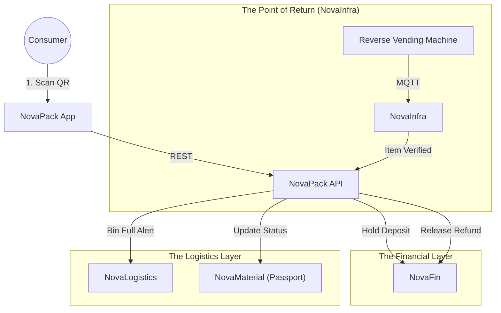

# 📦 NovaPack

> **The Operating System for Reusable Packaging.**
> Digital management of Deposit Return Schemes (DRS), reusable asset tracking, and circular packaging loops.

[](https://www.google.com/search?q=https://github.com/novaeco-tech/novapack/actions)
[](https://opensource.org/licenses/MIT)
[](https://www.google.com/search?q=https://packaging.novaeco.tech)

**NovaPack** is the Vertical Sector responsible for the "Container" layer of the economy. While `NovaRetail` tracks the product *inside* the box, **NovaPack** tracks the box itself. It provides the digital infrastructure for cities and brands to shift from "Single-Use" to "Reuse," managing the financial deposits and reverse logistics required to get a bottle back to the filler.

It acts as the compliance engine for the **EU Packaging and Packaging Waste Regulation (PPWR)**.

-----

## 🎯 Value Proposition

Packaging accounts for 36% of municipal solid waste. **NovaPack** solves the logistics of reuse:

1.  **Universal Deposit System:** A unified digital wallet for deposits. You pay a €1 deposit on a coffee cup in Berlin and get refunded when you drop it in a smart bin in Munich.
2.  **Asset Tracking:** Tracking millions of crates and pallets (B2B) to prevent loss and optimize cleaning cycles.
3.  **EPR Compliance:** Automated reporting for brands to prove they met their "Reuse Targets" (e.g., "30% of beverages sold in refillable bottles").

-----

## 🏗️ Architecture (The Reuse Loop)

NovaPack is a high-transaction-volume sector. It links physical return points (Reverse Vending Machines) with financial ledgers.



### Integrated Services

  * **[NovaFin](https://www.google.com/search?q=https://finance.novaeco.tech):** The escrow engine. When a product is sold, NovaFin holds the deposit. When NovaPack confirms the return, NovaFin releases the funds to the user.
  * **[NovaInfra](https://www.google.com/search?q=https://infrastructure.novaeco.tech):** Manages the "Smart Bins" and Reverse Vending Machines (RVM). It validates that the returned bottle is authentic and not a counterfeit.
  * **[NovaLogistics](https://www.google.com/search?q=https://logistics.novaeco.tech):** Optimizes the "Milk Run." It tells trucks exactly when to pick up empty crates from retailers to minimize empty miles.
  * **[NovaMaterial](https://www.google.com/search?q=https://materials.novaeco.tech):** Stores the material data of the packaging (e.g., "Food Grade rPET").

-----

## ✨ Key Features

### 1\. The Digital Deposit Engine (DDS)

Replaces physical tokens or paper receipts with a digital ledger.

  * **Check-Out:** +€0.50 added to bill. Token minted in `NovaFin`.
  * **Check-In:** User scans QR at drop-off. Token burned; €0.50 credited to wallet instantly.

### 2\. B2B Asset Pooling

For industrial crates and pallets.

  * **Cycle Counting:** Tracks how many "Trips" a crate has made.
  * **Maintenance:** Flags crates for repair (`NovaMake`) or recycling (`NovaRecycle`) after 50 cycles to prevent breakage.

### 3\. Smart Bin Orchestration

Prevents the "Overflowing Bin" problem.

  * Bins report fill-levels via `NovaInfra`.
  * NovaPack aggregates this data to predict peak return times (e.g., "Saturday Morning after the Market").

### 4\. Material Purity Guard

Ensures food safety for reuse.

  * Tracks what was last inside the container.
  * **Rule:** A bucket used for "Paint" (Chemicals) cannot be re-assigned to "Flour" (Food), even if washed.

-----

## 🚀 Getting Started

We use **DevContainers** to provide a consistent development environment.

### Prerequisites

  * Docker Desktop
  * VS Code (with Remote Containers extension)

### Installation

1.  **Clone the repo:**
    ```bash
    git clone https://github.com/novaeco-tech/novapack.git
    cd novapack
    ```
2.  **Open in VS Code:**
      * Run `code .`
      * Click **"Reopen in Container"** when prompted.
3.  **Start the Sector:**
    ```bash
    make dev
    ```
      * **Dashboard:** http://localhost:3000
      * **API:** http://localhost:8000/docs

### Configuration (`.env`)

```ini
# Scheme Settings
DEFAULT_DEPOSIT_VALUE=0.25
CURRENCY=EUR
MAX_CYCLES_BEFORE_RETIRE=100

# Integrations
NOVAFIN_URL=http://novafin-api:8000
NOVAINFRA_URL=http://novainfra-api:8000
```

-----

## 📂 Repository Structure

This is a Monorepo containing the sector's specific logic.

```text
novapack/
├── api/                # Python/FastAPI (Domain Logic)
│   ├── src/
│   │   ├── deposits/   # Escrow & Refund logic
│   │   ├── assets/     # Serialized container tracking
│   │   └── sanitation/ # Safety rules for food-grade reuse
├── app/                # React/Next.js Frontend (Consumer & Operator UI)
│   ├── src/
│   │   ├── wallet/     # User deposit view
│   │   └── scanner/    # QR Code reader for returns
├── website/            # Documentation (Docusaurus)
└── tests/              # Integration tests
```

-----

## 🧪 Testing

We use **Transaction Simulation** for testing.

  * **Deposit Flow:** `make test-deposit`
      * Simulates: Purchase (Deposit Lock) -\> 5 Days Pass -\> Return (Sensor Trigger) -\> Refund (Unlock).
  * **Bin Logic:** `make test-bins`
      * Simulates 50 bins filling up at different rates. Verifies that `NovaLogistics` receives a "High Priority" pickup request for the full ones.

-----

## 🤝 Contributing

We need contributors with backgrounds in **Logistics**, **Industrial Design**, and **IoT**.
See [CONTRIBUTING.md](https://www.google.com/search?q=../.github/CONTRIBUTING.md) for details.

**Maintainers:** `@novaeco-tech/maintainers-sector-novapack`